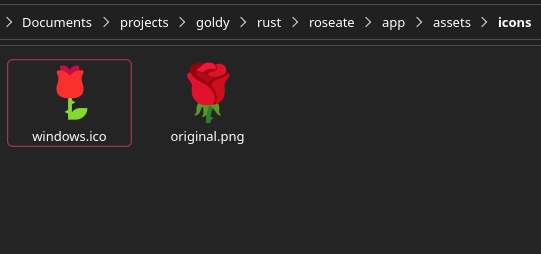
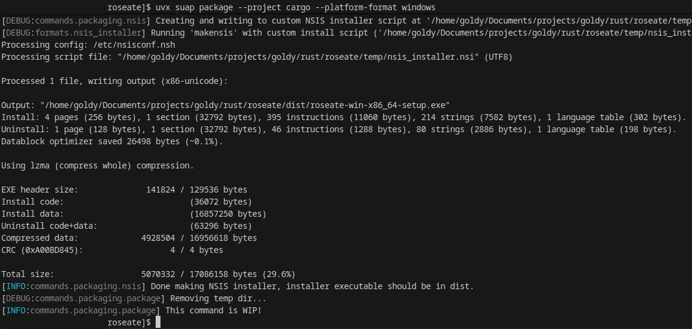
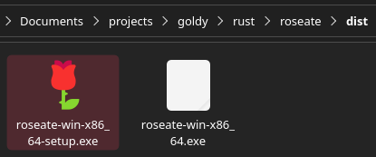

<div align="center">

  # 📦 suap

  <sub>*Just **S**hut **U**p **A**nd **P**ackage it, bloody hell mate...*</sub>

</div>

> [!WARNING]
> **USER NOTICE:** DO NOT use suap as a tool for building or installing cloudy-org applications, that is not the intent of the tool. 
> For application setup / installation check the application's own instructions in it's `README.md` file.
> 
> Suap is in alpha testing stage at the moment, feel free to submit PRs to improve my shit Python code in this project. Thanks

### Prerequisites:
- **[NSIS](https://nsis.sourceforge.io/Main_Page)** (for packaging windows installers)
- **[Rust](https://www.rust-lang.org/tools/install)** and **Cargo** (for packaging cargo projects).
  - **[x86_64-pc-windows-gnu](https://doc.rust-lang.org/nightly/rustc/platform-support/windows-gnu.html)** (for building windows binaries)

## Packaging Usage

### GitHub Workflow (CI)
```yml
# .github/workflows/suap.yml

name: Suap Package & Publish Binaries on Release Tag

# ... WIP, help wanted!
```

> [!WARNING]
> Suap is not really designed for usage in a development environment but 
> rather in CI. You would only really want to use it during development for testing.
> 
> Suap targets Python **3.13** support and currently only supports **Linux** (this may or may not change).

### Pip Install
```sh
python -m venv .venv
source .venv/bin/activate

pip install git+https://github.com/cloudy-org/suap@v0.1.0-alpha.1

suap --help
```

### UV Install
```sh
uv tool install --from git+https://github.com/cloudy-org/suap@v0.1.0-alpha.1 suap

uvx suap --help
```

Now that the tool is installed in your environment, make sure you're inside your cloudy-org applications's directory with `suap.toml` at it's root. 

If you don't have a `suap.toml` file, create one from the example **[here](./examples/suap.toml)**.

From here on you can query the help command for various actions you can perform other than packaging.

```sh
suap --help
```

### Packaging
```sh
suap package --project cargo --platform-format windows
```

#### Project
In the future a suap project may have multiple types of projects under it so you must specify which type you're packaging via `--project` <sub>(at least for now)</sub>.

#### Platform format
At this moment there are 3 platform formats you can package to:

- `linux-bin` ([standalone binary][uploading-bins-covention])
- `windows-bin` ([standalone binary][uploading-bins-covention])
- `windows-setup` ([windows installer][uploading-bins-covention])

```sh
--platform-format {platform}-{format}
```

The `windows` platform format key is an umbrella key to build and package both formats `windows-bin` and `windows-setup`, the same way the `linux` key contains `linux-bin`.

Use the specific key (e.g: `linux-bin`) if you would like to target packaging just that format and not any other format under that platform.

#### Icons
In the `suap.toml` config we set the icons folder (`icons = "./assets/icons"`). We must populate that with icons for the application (be it placeholders or real official icons for prod):

```toml
# The icons folder is where you'll place your icons.
# 
# The name of the image files must be specific like so:
# "windows.ico" - windows specific app icon
# "original.png" - when there's no platform specific icon suap falls back to this
icons = "./assets/icons"
```

Here's an example:



#### Output
And here's me using suap to package windows binaries for roseate with the command from earlier:



The `./dist` folder:



<br>

*Readme Work In Progress...*


[uploading-bins-covention]: https://github.com/cloudy-org/.github/blob/main/convention/releases.md#the-convention-of-uploading-binaries